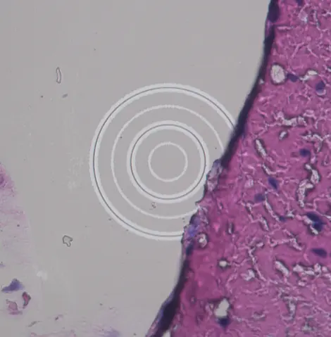
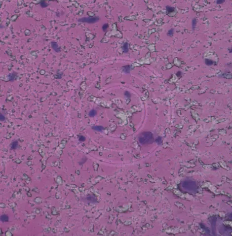
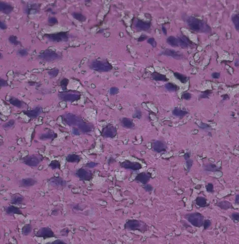

# Align image to transcriptome
In the previous step, the transcriptomic reads were processed and mapped in tissue space with spacemake.
Now, in order to assign transcripts to cells from the staining images, we perform a pairwise alignment 
between the imaging and spatial transcriptomics modality.

`openst` provides tools to automatically or manually carry out this pairwise alignment operation. For this,
our tool generates *pseudoimages* of the spatial transcriptomics data, such that computer vision algorithms
can be used for the alignment of true staining images and the ST modalities.

The alignment workflow consists of two steps, that can be performed [automatically] or [manually]:

1. Coarse alignment of H&E images to pseudoimages of ST data - at low resolution.
2. Fine alignment, using fiducial marks detected at both modalities for very precise alignment.

[automatically]: #automated-workflow
[manually]: #manual-workflow

## Required input data
For automatic and manual alignment, two inputs are required: (1) a stitched tile-scan of 
the staining image (see [Preprocessing of imaging](preprocessing_imaging.md)), and (2) a
single [h5ad] file containing all the [barcoded tiles](preprocessing_sequencing.md#flow-cell-related-terms) of a sample 
(see [Preprocessing of sequencing](preprocessing_sequencing.md)). 

!!! warning
    Remember that spacemake generates one file per [barcoded tile](preprocessing_sequencing.md#flow-cell-related-terms), 
    and it will be necessary to perform [stitching of tiles](preprocessing_sequencing.md) to
    obtain a single file with all tiles for a sample. This is done with `openst spatial_stitch`.

### Image modality
The expected input for the image modality is a single tiff file of the whole tile-scan.
Other formats, i.e., `jpeg` and `png` are also compatible. Make sure that the image is the full-resolution
and not a downsampled version. As a rule of thumb, at least a few fiducial markers must be clearly distinguishable.

=== "Good visibility"
    { loading=lazy }

=== "_Fair_ visibility"
    { loading=lazy }

=== "_Poor_ visibility"
    { loading=lazy }

### Spatial transcriptomics modality
The expected input for the spatial transcriptomics modality is a single [h5ad] file containing all
the [barcoded tiles](preprocessing_sequencing.md#flow-cell-related-terms) of a sample. 

!!! warning
    Remember that spacemake generates one file per [barcoded tile](preprocessing_sequencing.md#flow-cell-related-terms), and it will be necessary to perform
    [stitching of tiles](preprocessing_sequencing.md#global-spatial-coordinates-tile-stitching) to obtain a single file with all tiles for a sample.

The structure of this single file must follow the [h5ad] standard. In particular, we expect that there is a
column under `obs` called `tile_id`, telling which tile a barcode belongs to. Also, we expect a column 
`total_counts` indicating the total count of unique transcripts per barcode. Finally, we expect that there is
a barcodes-by-2d matrix under `obsm` (with the name `spatial`), containing the spatial coordinates of the barcoded
spots.

[h5ad]: https://anndata.readthedocs.io/en/latest/fileformat-prose.html

## Automated workflow
If you want to save time, we provide a script that performs coarse and fine steps of alignment 
automatically, by leveraging computer vision algorithms. To do so, make sure that you have the [necessary
input data](#required-input-data); then, open a termina, type and run the following command (just an example):

```bash
# Add the image data to the Open-ST h5 object
openst merge_modalities \
    --h5-in spatial_stitched_spots.h5ad \
    --image-in Image_Stitched_Composite.tif

# Run the automatic pairwise alignment
openst pairwise_aligner \
    --h5-in spatial_stitched_spots.h5ad \
    --metadata alignment_metadata.json
    # --device cuda # by default, cpu. Only specify if you have cuda-compatible GPU
    # --only-coarse # does not run the fine registration; can be done manually with the GUI
```

Make sure to specify a path where the metadata output file 
should be created via `--metadata`, for later visual assessment of the alignment.

If you want to run only the coarse phase of the pairwise alignment (i.e., to run the fine
alignment [yourself](#manual-workflow)), you can specify the argument `--only-coarse`.

!!! note
    For aligning STS to H&E-stained tissues, **we recommend** leaving the arguments with the default values. 
    Anyway, you can get a full list of configurable parameters by running `openst pairwise_aligner --help`.

!!! tip
    Right after automatic alignment and before
    proceeding to segmentation and aggregating into a cell-by-gene matrix,
    **we strongly recommend** visually assessing the alignment results. Specifically, that
    the tissue is overall well-aligned in both modalities, and that the fiducial markers are
    overlapping across all tiles.

!!! tip
    If the coarse (or fine) registration doesn't work, there are several parameters that you can change.
    The most important ones are:
        - `--rescale-factor-coarse` or `--rescale-factor-fine`: the highest, the lower resolution the image; thus, more _global_ features are used for registration
        - `--threshold-counts-coarse` or `--threshold-counts-fine`: the highest, the less spots there will be on the image
    
    These allow to increase the number of matches and possibly the number of RANSAC inliers. There are other RANSAC-specific parameters that can be changed, such as `--ransac-coarse-residual-threshold`, `--ransac-coarse-max-trials` and `--ransac-fine-min-samples`. For more parameters, check `openst pairwise_aligner --help`.

!!! warning
    In some environments, the following error might happen:
    
    ```sh
    qt.qpa.plugin: Could not load the Qt platform plugin "xcb" in "/home/user/miniconda3/envs/openst/lib/python3.11/site-packages/cv2/qt/plugins" even though it was found.

    This application failed to start because no Qt platform plugin could be initialized. Reinstalling the application may fix this problem.

    Available platform plugins are: xcb, eglfs, linuxfb, minimal, minimalegl, offscreen, vnc, wayland-egl, wayland, wayland-xcomposite-egl, wayland-xcomposite-glx, webgl.
    ```

    This can be solved by removing the files inside `/home/user/miniconda3/envs/openst/lib/python3.11/site-packages/cv2/qt/plugins`, e.g. see this [StackOverflow thread](https://stackoverflow.com/questions/71029300/python-pyqt-xcb-plugin-with-thread-error)
    

### Visual assessment with report
You can generate an HTML report that contains a qualitative summary of the alignment (images, parameters...)

```sh
openst report --metadata=alignment_metadata.json --html-out=alignment_report.html
```

### Visual assessment with GUI
Alternatively, you can visualize the images & ST data interactively using the GUI.

```sh
openst manual_pairwise_aligner
```

We provide a Graphical User Interface (GUI) for selecting keypoints between imaging & ST modalities, 
for visualization and refinement of automatic results. This GUI requires a single Open-ST h5 object,
the output of `openst pairwise_aligner`.


## Manual/semiautomatic workflow
We provide a Graphical User Interface (GUI) for selecting keypoints between imaging & ST modalities, 
for full manual alignment or refinement of automatic results. This GUI requires a single Open-ST h5 object
(after spatial stitching). There are two kinds of workflow:

=== "Fully manual alignment"

    ``` sh
    # Add the image data to the Open-ST h5 object
    openst merge_modalities \
        --h5-in spatial_stitched_spots.h5ad \
        --image-in Image_Stitched_Composite.tif

    # Use the GUI to select the keypoints.json file
    openst manual_pairwise_aligner

    # Compute a rigid transformation from keypoints.json and apply it to the data
    openst apply_transform \
        --keypoints-in keypoints.json \
        --h5-in spatial_stitched_spots.h5ad \
        --spatial-key-in 'obsm/spatial' \
        --spatial-key-out 'obsm/spatial_manual_transformed'
        ## --per-tile # when specified, there's one rigid transform per tile
    ```

=== "Semiautomatic alignment"

    ``` sh
    # Use the GUI to select the keypoints.json file
    # For per-tile alignment, select keypoints per tile (see video below)
    openst manual_pairwise_aligner

    # Compute a rigid transformation from keypoints.json and apply it to the data
    openst apply_transform \
        --keypoints-in keypoints.json \
        --h5-in spatial_stitched_spots.h5ad \
        --spatial-key-in 'obsm/spatial_pairwise_aligned_fine' \
        --spatial-key-out 'obsm/spatial_pairwise_aligned_refined'
        ## --per-tile # when specified, there's one rigid transform per tile
    ```

We provide a video showcasing the GUI, with an illustrative example of refinement from (coarse) automated alignment.

---

:fontawesome-brands-youtube:{ style="color: #EE0F0F" }
__[Walkthrough of the GUI for manual alignment]__ by @danilexn – :octicons-clock-24:
5m – Learn how to visualize and align STS and imaging data in a step-by-step guide.

  [Walkthrough of the GUI for manual alignment]: https://www.youtube.com

---

## Expected output
After running the automatic or manual alignment, you must have a single `h5ad` file, containing the transformed spatial coordinates.
This will be used in the following step to aggregate the transcripts by a spatially-corresponding cell, in order to get a cell-by-gene
matrix that can be used in later downstream analysis.